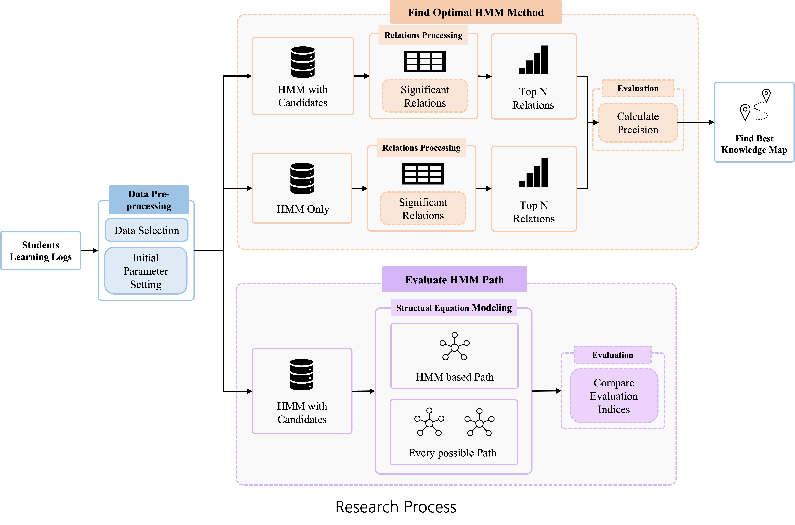
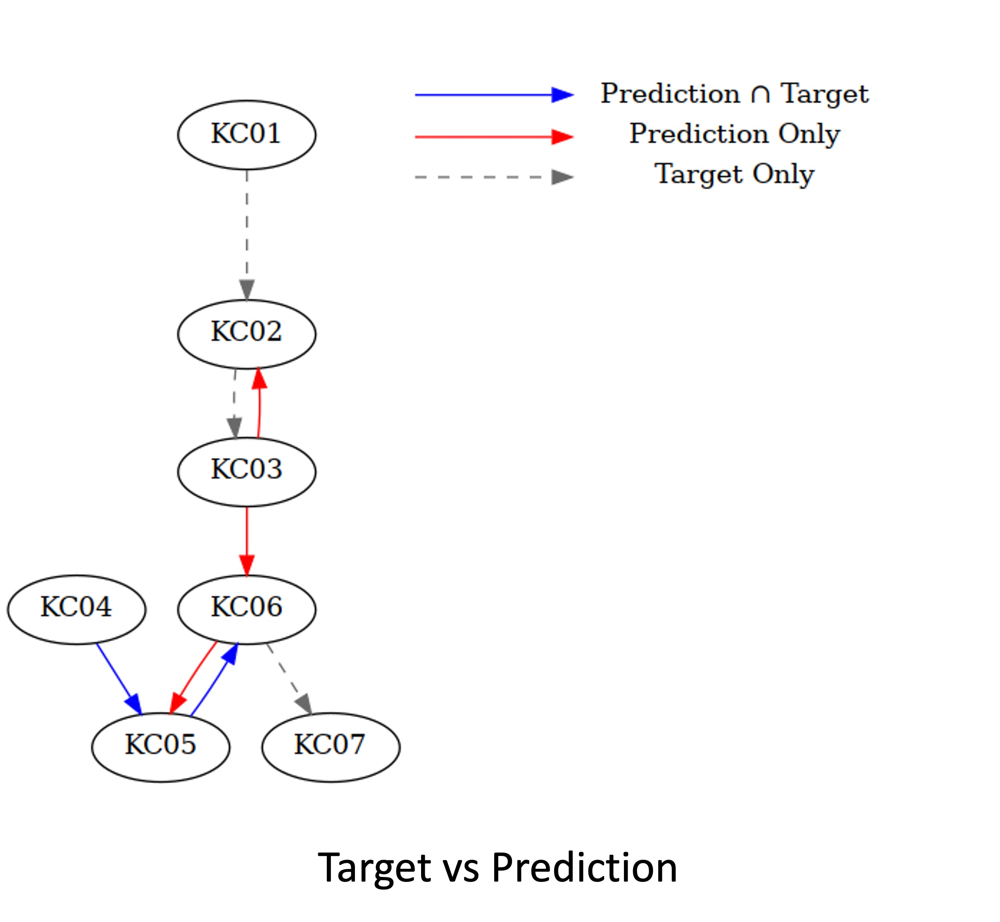
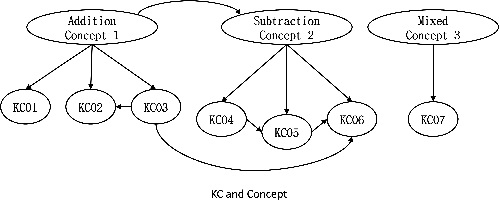

# PathAnalysis

This is the official implementations of **On adaptive learning paths using hidden Markov models**(JKDAS, 2023.02). For technical details, please refer to:  

**On adaptive learning paths using hidden Markov models** [[DOI]()]
Hyunhee Choi, Yunji Lee, Hayun Lee


### (1) Setup
This code has been tested with R 4.2.2, Python 3.8, hmmlearn 0.2.8, CUDA 11.2 and cuDNN 8.0 on Ubuntu 20.04.  
* Clone the repository
```code
git clone https://github.com/LAIVDATA-EdTech-R-D/Path-Analysis.git
```
* Setup dependencies
```code
conda create -n PathAnalysis python=3.8
conda activcate PathAnalysis
deb https://cloud.r-project.org/bin/linux/ubuntu focal-cran40/
sudo apt-get update
sudo apt-get install r-base
cd PathAnalysis
```
### (2) AI-Hub dataset
AI-Hub(Mathematics learner's ability level measurement data) mathmatics dataset can be found [here](https://aihub.or.kr/aihubdata/data/view.do?currMenu=115&topMenu=100). We extracting the learner's log related with Addition & Subtraction. Data Format is:  
|Learner no. \ KC|KC01|KC02|...|KC07|
|------|---|---|---|---|
|1|1|0|...|1|
|2|1|0|...|1|
|...|...|...|...|...|
|183|1|1|...|1|
0: Incorrect, 1: Correct 

### (3) Analysis
* KC Relation Selection using LASSO & RF
```code
Rscript Elasso_RF.R
```
* Hidden Markov Model
    * HMM with KC Relation Selection
    ```code
    python FeatureSelectionHMM.py
    ```
    * HMM without KC Relation Selection
    ```code
    python OnlyHMM.py
    ```
* Structural Equation Modeling
    * SEM
    ```code
    Rscript PLSPM_SEM.R
    ```
    * SEM for every possible paths
    ```code
    Rscript PLSPM_SEM_Every.R
    ```

### (4) Result(Graph)
|KC prerequisite graph(KC Map)|Learning Path|
|-|-|
|||
